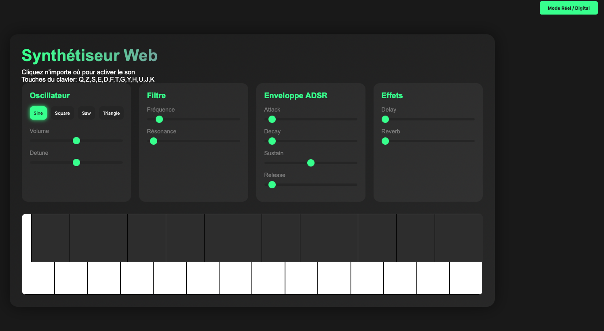
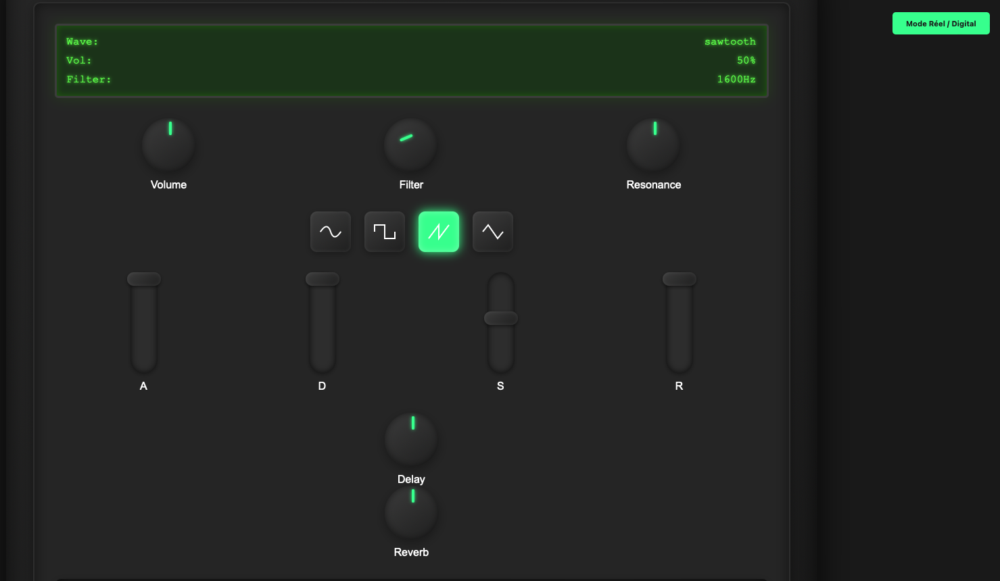

# Synth 🎹

### Digital & Analogic Mode 🎶

#### Made with ClaudeDev 🦾

OpenRouter API - anthropic/claude-3.5-sonnet:beta

Tokens: Input 2.2m Output 57.5k
API Cost: $1.8739

### Coming soon : Additional Modules 🎛️

Sequencer

LFO (Low-Frequency Oscillator)

Envelope Generator

Mixer

Oscillator Sync

Sample and Hold

Noise Generator